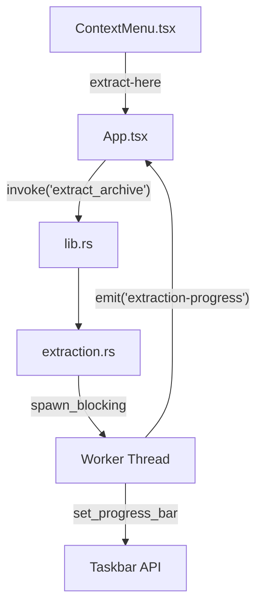

# Archive Extraction & Progress Knowledge Base

Implementation of native, performant archive extraction with real-time, byte-based progress feedback for Windows.

## Overview
SpeedExplorer provides native "Extract Here" functionality for ZIP and 7Z formats, leveraging Rust's `zip` and `sevenz-rust` crates. The system is designed to provide smooth UI feedback via the Windows Taskbar without freezing the main thread.

## Architecture

### Components
1.  **Backend Module (`extraction.rs`)**:
    *   Handles decompression logic using specialized crates.
    *   Calculates progress based on **bytes written** rather than file count.
    *   Emits events and updates native taskbar state.
2.  **Command (`extract_archive`)**:
    *   Asynchronous Tauri command that wraps blocking work in `tokio::task::spawn_blocking`.
3.  **Taskbar Integration**:
    *   Uses Tauri's `ProgressBarState` to update the native Windows progress indicator.

## Progress System (Byte-Based)

The progress system transitioned from a simple file-counter to a byte-tracking system to ensure smoothness even for single large files.

### Key Features
*   **Pre-scanning**: Before extraction, the archive is scanned to sum the `total_uncompressed_size` of all entries.
*   **Buffered Copy (64KB)**: Data is moved from the archive stream to the disk in small chunks. Progress is updated after each chunk.
*   **Throttling**: To avoid saturating the IPC (Inter-Process Communication) and Taskbar API, updates are only emitted if the percentage changes by at least **1%**.
*   **Graceful Finish**: Upon completion, the bar is set to 100% and a 200ms delay is introduced before clearing it (`ProgressBarStatus::None`), allowing Windows animations to finish properly.

## Format Specifics

### ZIP Extraction
*   Uses `zip::ZipArchive`.
*   Includes "Smart Folder" detection: If an archive contains a single root folder, the contents are flattened one level to avoid double-nesting (e.g., `Archive/Archive/file` -> `Archive/file`).

### 7Z Extraction (The Streaming Challenge)
High-level extraction functions in `sevenz-rust` are "black boxes" that don't provide intra-file progress.
*   **Final Implementation**: Uses `decompress_file_with_extract_fn` with a manual extraction closure.
*   **Closure Logic**: Instead of calling the library's default extractor, we manually create the file on disk and use a `loop` to `read` from the provided decompressed stream into our own buffer. This is the only way to get granular progress in 7Z.

## Lessons Learned & Best Practices
*   **Taskbar Latency**: Windows Taskbar UI updates are not instantaneous. Revisions should be throttled and clearing the bar too quickly after completion may result in the user missing the "finished" state.
*   **Closure Captures**: In long-running blocking tasks, ensure that progress variables are either mutable within an `FnMut` closure (if executed sequentially) or use `Arc<AtomicU64>` if thread safety is required.
*   **Error Handling**: Always reset the taskbar state (`ProgressBarStatus::None`) in the finalizer or `Result` handler to ensure the icon doesn't get stuck in a "work" state on error.
